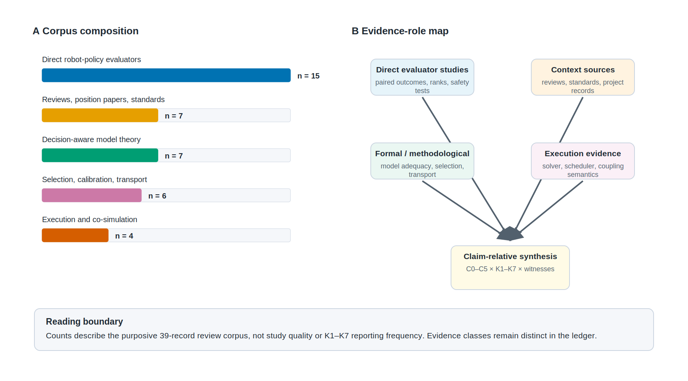
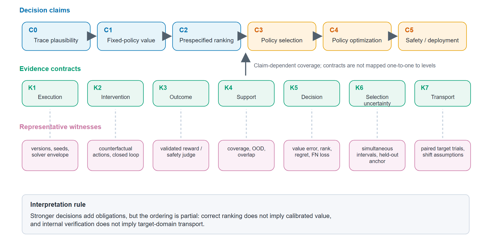
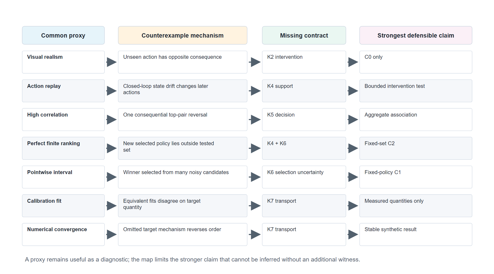

# Evidence Sufficiency for AI-Based Robot Policy Evaluation: From Physics Simulators to Learned World Models

**Status:** `AIRE_TARGETED_INTERNAL_DRAFT_V1.1 / STRUCTURED_CRITICAL_REVIEW / NO_NEW_EXPERIMENTS`
**Search cutoff:** 2026-07-22 (targeted update documented; full-text closure pending)
**Target:** *Artificial Intelligence Review*, review article; no submission authorized.

## Title-page information

**Authors, in approved order:** Yuan Liao, Hui Liu, Jiliang Tu, Jing Jiang, Zaihong Wan, Jianbo Gao, Ting Fang, Zhiwei Hu.

**Affiliation:** School of Information Engineering, Nanchang Hangkong University, No. 696 Fenghe South Avenue, Honggutan District, Nanchang, Jiangxi 330063, China.

**Corresponding author:** Yuan Liao, liaoyuan@nchu.edu.cn; ORCID: 0009-0007-6991-9049. Telephone information is retained in the internal author record for the submission system and is not reproduced in the manuscript draft.

## Abstract

Artificial-intelligence-based robot policies are increasingly evaluated in physics simulators, reconstructed digital twins, and learned world models because physical trials are costly, slow, and difficult to reproduce. However, reported evidence ranges from visual similarity and action following to paired real-robot trials, rank metrics, and confidence intervals. These quantities answer different questions, and their mismatch can turn a plausible rollout into an unsupported selection or safety claim. This structured critical review synthesizes evidence sufficiency for simulator- and world-model-based robot-policy evaluation by the decision supported: fixed-policy value estimation, ranking, selection, optimization, or safety screening. We introduce a claim-contract-witness framework spanning execution identity, intervention fidelity, outcome validity, support, decision alignment, selection-valid uncertainty, and transport to a stated context of use. Analytical counterexamples explain why observational fidelity cannot establish intervention validity, finite-set rank agreement cannot support unrestricted policy selection, and internal numerical verification cannot replace target-domain evidence. The framework is not an empirically validated certification standard. It is a falsifiable methodology for matching evidence strength to claim strength, comparing heterogeneous evaluator classes, and designing prospective studies of evaluator-assisted robot-policy decisions.

## Keywords

artificial intelligence; robot policy evaluation; learned world models; simulation validation; evidence sufficiency; policy selection

## 1. Introduction

Evaluating a robot policy is an inference problem before it is a benchmarking problem. A reported success rate, ranking or safety screen is used to decide which checkpoint to retain, which policy to deploy, or which failure mode deserves additional physical testing. Real-robot trials provide the most direct evidence for these decisions, but they are expensive, slow, difficult to standardize and potentially unsafe. Physics simulators and real-to-sim reconstructions therefore offer repeatable synthetic trials, while action-conditioned video world models promise to generate interactive rollouts from comparatively little scene engineering. This shift is now visible in paired evaluation systems such as SIMPLER, WorldEval, WorldGym, PolaRiS and RobotArena Infinity, as well as in industrial demonstrations of video-world-model evaluators ([Li et al., 2025](https://proceedings.mlr.press/v270/li25c.html); [WorldEval, 2025](https://arxiv.org/abs/2505.19017); [Quevedo et al., 2025](https://arxiv.org/abs/2506.00613); [PolaRiS, 2025](https://arxiv.org/abs/2512.16881); [Jangir et al., 2026](https://openreview.net/forum?id=OutljIofvS&noteId=G41zT4Zecs)).

The central methodological problem is that an evaluator can look convincing without supporting the decision made from it. A learned world model may generate realistic observations but respond incorrectly to an action. A simulator may reproduce the average success of several fixed policies yet reverse the order of a newly optimized policy that exploits an omitted mechanism. A rank correlation computed over a small set of checkpoints may remain high while the identity of the selected checkpoint is unstable. Even a numerically reproducible co-simulation can be systematically wrong about the target domain. These are not variants of one scalar “reality gap.” They are failures at different links in an inferential chain.

Several mature literatures expose parts of this chain. Paired real-to-sim studies evaluate policy-ranking agreement and introduce rank-sensitive metrics such as mean maximum rank violation ([Li et al., 2025](https://proceedings.mlr.press/v270/li25c.html)). Model-based reinforcement learning distinguishes predictive accuracy from decision usefulness: one-step likelihood can be mismatched with downstream control performance, while value equivalence defines model adequacy relative to sets of policies and value functions ([Lambert et al., 2020](https://proceedings.mlr.press/v120/lambert20a.html); [Grimm et al., 2020](https://papers.nips.cc/paper/2020/hash/3bb585ea00014b0e3ebe4c6dd165a358-Abstract.html)). Robot policy optimization in approximate simulators can amplify modeling errors into simulation optimization bias, and offline model-based reinforcement learning uses pessimism or uncertainty penalties to restrict such exploitation ([Muratore et al., 2018](https://proceedings.mlr.press/v87/muratore18a.html); [Yu et al., 2020](https://proceedings.neurips.cc/paper_files/paper/2020/hash/a322852ce0df73e204b7e67cbbef0d0a-Abstract.html); [Kidambi et al., 2020](https://proceedings.neurips.cc/paper/2020/hash/f7efa4f864ae9b88d43527f4b14f750f-Abstract.html)). Statistical work separately shows that adaptive reuse and data-dependent policy selection require stronger control than evaluation of one fixed query ([Dwork et al., 2015](https://proceedings.neurips.cc/paper_files/paper/2015/hash/bad5f33780c42f2588878a9d07405083-Abstract.html); [Yin et al., 2021](https://proceedings.mlr.press/v130/yin21a.html)).

Verification and validation provide another necessary perspective. Risk-informed model-credibility frameworks tie the required rigor of evidence to a stated context of use and to the consequence of an incorrect decision ([ASME V&V 40-2018](https://www.asme.org/codes-standards/find-codes-standards/assessing-credibility-of-computational-modeling-through-verification-and-validation-application-to-medical-devices)). Calibration literature distinguishes parameter fit from model discrepancy, and work on unobserved quantities shows that agreement on measured outputs need not validate a new quantity of interest ([Kennedy and O'Hagan, 2001](https://doi.org/10.1111/1467-9868.00294); [Oliver et al., 2015](https://doi.org/10.1016/j.cma.2014.08.023)). At the implementation level, solver ownership, event ordering, coupling and stopping tolerances can change a co-simulation's behavior even when its interface is compliant ([Cremona et al., 2019](https://doi.org/10.1007/s10270-017-0633-6); [Hansen et al., 2022](https://doi.org/10.3390/electronics11213635)).

Recent reviews and position papers have begun to connect world-model evaluation to downstream decision making. A 2026 position paper organizes world-model metrics from artifact-level diagnostics to policy optimization utility and emphasizes action fidelity, policy ranking, exploitability and uncertainty ([Yu et al., 2026](https://arxiv.org/abs/2606.15032)). A broader survey maps world models across robot learning, planning, simulation, evaluation and data generation ([Hou et al., 2026](https://arxiv.org/abs/2605.00080)). These accounts make a generic metric ladder unnecessary. The remaining problem is more specific: given a particular policy claim and decision, which evidence obligations must be discharged, which common proxies are insufficient, and how should uncertainty and transport be reported when the evaluator itself helps choose the policy?

Table 1 makes the distinction from the closest reviews and position papers explicit. The comparison is about organizing questions, not relative quality. Existing work supplies the architectural landscape, the reality-gap background, or a decision-centric metric ladder. This review instead connects a named downstream claim to execution, intervention, outcome, support, decision, selection-validity, and transport obligations across both engineered and learned evaluators.

**Table 1. Positioning against the closest review-level sources**

| Source | Primary organizing question | Evaluator scope | Selection and adaptive reuse | Execution semantics | Claim-relative witnesses |
|---|---|---|---|---|---|
| Yu et al. (2026) | How should embodied world models be evaluated from artifact quality to policy utility? | learned world models | addressed at exploitation/optimization levels | not a central organizing layer | metric ladder and decision-centered diagnostics |
| Hou et al. (2026) | How are world models used across robot learning, planning, simulation, evaluation, and data generation? | learned world models | landscape coverage rather than an inferential contract | outside the central taxonomy | architecture- and use-oriented survey |
| [Yang et al. (2026)](https://www.annualreviews.org/content/journals/10.1146/annurev-control-031924-100130) | What causes the robotics reality gap and how can it be mitigated? | simulation and sim-to-real systems | not the central review question | included as part of simulation practice | transfer challenges, methods, and best practices |
| This review | What evidence is sufficient for a specified value, ranking, selection, optimization, or safety claim? | physics simulators, digital twins, co-simulations, and learned world models | explicit K6 obligation with multiplicity and adaptive reuse | explicit K1 obligation | C0--C5 claims mapped to K1--K7 and minimum witnesses |

We address this problem through a structured critical review spanning physical simulators, digital twins, learned world models, decision-aware model learning, computational-model validation and selection-aware inference. This cross-disciplinary framing places robot evaluation inside the broader AI problem of deciding when a learned or engineered surrogate is adequate for a downstream decision. The review makes four contributions. First, it defines evaluation claims by their estimand, policy set, target context, tolerance, confidence and downstream decision, thereby replacing unqualified statements that an evaluator is “valid.” Second, it synthesizes seven evidence contracts—execution identity, intervention fidelity, outcome validity, support and coverage, decision alignment, selection-valid uncertainty, and target-domain transport. Third, it provides counterexample families that delimit what visual fidelity, action replay, finite-set rank agreement, calibration fit and internal numerical checks can establish. Fourth, it translates the synthesis into a reporting checklist and a prospective validation agenda. The proposed framework is a review-derived methodology, not a certification standard; its value must ultimately be tested by whether it predicts evaluator failures and improves policy decisions across independent robot domains.

## 2. Review methodology

### 2.1 Review design and scope

We conducted a structured critical and theoretical review rather than a systematic review or meta-analysis. The unit of analysis was an inferential link between evaluator evidence and a robot-policy claim. Eligible evaluators included physics simulators, heterogeneous co-simulations, real-to-sim or digital-twin reconstructions, learned latent dynamics models and action-conditioned video world models. Eligible claims included fixed-policy value estimation, pairwise or full ranking, checkpoint or policy selection, iterative optimization, safety screening and support for deployment in a stated target context. The review is problem-driven and purposive: it is designed to integrate otherwise disconnected evidence obligations, not to estimate the prevalence of reporting practices or a pooled effect.

The primary search window covered 2015 to 22 July 2026, capturing modern robot-learning simulators and learned world models. Earlier sources were retained when they supplied foundational concepts for calibration, discrepancy, robust decision making, model equivalence, numerical verification or adaptive inference. We excluded papers that used simulation only for training without making or analyzing an evaluation-validity claim. We also excluded simulator-only leaderboards that compared policies but did not connect the comparison to evaluator adequacy, target-domain behavior or a transferable failure mechanism.

### 2.2 Search and source verification

Searches combined terms for robot policy evaluation, policy ranking, checkpoint selection, simulation, real-to-sim reconstruction, digital twins, action-conditioned world models, value equivalence, objective mismatch, model exploitation, computational-model credibility, uncertainty, finite-sample inference and post-selection validity. We searched archival proceedings and journal indexes, including PMLR and official NeurIPS pages, as well as OpenReview, arXiv and official standards pages. Backward and forward citation chasing began from SIMPLER, WorldEval, WorldGym, the value-equivalence paper, objective-mismatch work, simulation optimization bias and ASME's context-of-use credibility framework.

We prioritized primary sources. An arXiv record was retained when no archival version had been verified by the cutoff date and was labelled as a preprint. Project pages were used only for protocol details or current-system descriptions and were not treated as independent validation. Corporate reports were coded as grey literature. Standards were treated as normative or methodological sources rather than as empirical studies.

Five search clusters were used to prevent the corpus from being dominated by the terminology of one community. The first two combined robotics terms with policy evaluation, ranking, simulation, digital twins, learned simulators and action-conditioned world models. The third targeted decision-aware model adequacy through value equivalence, objective mismatch, model exploitation and pessimism. The fourth connected simulation and co-simulation to verification, validation, credibility and context of use. The fifth targeted finite-sample, uniform, multiple-comparison and post-selection inference. Search records were retained in a source ledger containing the persistent identifier, venue or evidence class, claimed decision, evidence supplied and the strongest limitation relevant to this review.

Source verification and substantive appraisal were kept separate. Verification established that a record, identifier and version existed at the stated location; it did not certify that the paper supported the manuscript's interpretation. Archival versions took precedence over preprints when both were verified. When only an abstract, project page or standard landing page had been inspected, the record remained eligible for landscape mapping but could not independently support a detailed effectiveness claim. This distinction is particularly important for rapidly changing 2025–2026 systems whose titles, versions or publication status may change after the search cutoff.

### 2.3 Screening and evidence coding

Each included source was coded along twelve fields: evaluator type; target claim; policy scope; target-domain anchor; action-intervention design; support audit; evaluation metric; uncertainty procedure; execution semantics; post-selection use; transport scope; and evidence tier. Policy scope distinguished one frozen policy, a prespecified finite set, checkpoints from one training run, an architecture family and an adaptively generated class. Target anchors distinguished no target data, observational target data, open-loop replay, paired closed-loop evaluation and real-policy trials.

We used four non-ordinal evidence tiers. E1 denoted direct target-domain decision evidence, such as paired closed-loop evaluator and real-robot trials over multiple prespecified policies with explicit uncertainty and scope. E2 denoted a direct component test or formal result that discharged one or more obligations without closing the full transport claim. E3 denoted indirect diagnostics such as visual realism, one-step prediction, action following or internal consistency. E4 denoted reviews, position papers, standards, project pages and grey literature. The tiers were claim-relative: an E1 study for ranking a fixed policy set could still provide no direct evidence for selecting policies outside that set.

Inclusion required either a direct robot-policy evaluator study or a transferable result that changed what could be inferred from evaluator evidence. The latter category included theory of model adequacy, calibration and discrepancy, support, adaptive selection, numerical verification and transport. We excluded simulation papers concerned only with policy training, simulator-only leaderboards with no evaluator-validity claim, visual-generation studies without an embodied action or downstream-decision link, secondary summaries when the primary source was available, and vendor claims lacking enough information to classify the policy set, target domain, intervention and metric. Limitations were coded as author-stated, review-inferred or directly demonstrated so that a theoretical counterexample was not conflated with a limitation merely inferred from absent reporting.

### 2.4 Bias and applicability appraisal

For direct evaluator studies, we recorded whether the policy set was fixed before target-domain testing, whether target trials were reused to construct or tune the evaluator, and whether the reported uncertainty accounted for dependence across policies and tasks. We also recorded the diversity and number of policies, tasks, scenes, embodiments and target trials; the source and validation of reward or success labels; direct action-following and OOD tests; and whether failures capable of changing policy order were sought. Applicability was assessed against the stated context of use rather than against an abstract notion of simulator quality.

The appraisal focused on inferential risks rather than assigning a single study-quality score. Three risks were especially important. First, target-data reuse can make an apparently paired validation set part of evaluator development. Second, a large episode count can overstate precision when policies, tasks, reconstructed scenes or repeated rollouts are dependent. Third, outcome-label error can be hidden inside the evaluator when success is supplied by a scripted detector, learned classifier, vision-language model or human rubric. These risks were mapped to K7, K6 and K3, respectively, and were carried into the claim scope even when the source did not discuss them explicitly.

### 2.5 Synthesis

We did not pool correlations or success-rate differences because policy sets, task distributions, target anchors and evaluator architectures were heterogeneous. Instead, sources were synthesized by the decision they attempted to support. For each decision level, we identified the weakest evidence link, the assumptions needed to bridge that link, and directly relevant counterexamples or bounds. This process yielded the claim–contract–witness framework described in Section 3. Elementary propositions were then formulated to make recurring insufficiency arguments falsifiable. These propositions are analytical syntheses of prior theory and simple constructions; they are not presented as empirical findings.

The synthesis proceeded in three passes. The first placed each source at the strongest claim level for which it supplied direct evidence. The second mapped the reported evidence to K1–K7 and identified obligations left implicit or unsupported. The third searched for a counterexample, bound or methodological result capable of testing whether the proposed bridge was necessary. Disagreements among metrics were not averaged away: value calibration, rank agreement, regret and safety false negatives were retained as different estimands. This claim-first organization also prevents a technically sophisticated simulator paper from being treated as stronger evidence merely because it reports more diagnostics.

### 2.6 Review limitations

This manuscript is a structured critical review, not a systematic review or meta-analysis. Its current purposive core contains 39 records selected to cover direct robot-policy evaluators, adjacent surveys and standards, decision-aware model theory, selection and transport statistics, and execution semantics. It does not claim exhaustive database coverage, duplicate independent screening or a pooled effect estimate. A documented targeted update was performed on 22 July 2026 across official arXiv, PMLR and NIST records; six candidates were inspected, five were retained and one real-only evaluation-automation record was excluded from the core. Before submission, every source supporting a substantive claim still requires full-text coding. The 2025–2026 world-model literature is moving rapidly, and several central systems are represented by preprints, project pages or workshop records at the search cutoff. These limitations constrain claims of literature completeness but do not remove the methodological distinction between evidence proxies and decision claims.

The present coding was developed as part of the same synthesis that produced the seven contracts, so framework construction and literature appraisal are not independent. The manuscript therefore cannot estimate how reliably independent reviewers would apply K1–K7 or whether the contracts predict evaluator failure. Publication and language bias are also possible because the working corpus emphasizes English-language sources available through major robotics, machine-learning and simulation venues. These limitations are addressed in the research agenda through preregistered coding, independent raters and prospective outcome-blinded validation; they are not resolved by the current review.

*Figure 3. Literature landscape of the structured review. (A) Composition of the purposive 39-record corpus after the 22 July targeted update. Counts describe source groups, not study quality or K1–K7 reporting frequency. (B) Direct evaluator studies, context sources, formal and methodological work, and execution evidence contribute different roles to the claim-relative synthesis.*

## 3. From evaluator scores to evaluation claims

### 3.1 A claim-relative definition of sufficiency

The statement that an evaluator is “valid” is incomplete unless the intended inference is named. We represent an evaluation claim as

**C = (E, Π, Z, q, L, ε, α, D),**

where E is the evaluator, Π is the prespecified policy set or class, Z is the target context distribution, q is the quantity of interest, L is the loss caused by a wrong evaluator-supported decision, ε is the tolerated loss, α is the tolerated error probability, and D is the downstream decision. Two studies that use the same simulator can therefore make materially different claims: estimating the mean success of one frozen policy is not equivalent to selecting the best of hundreds of checkpoints, and neither is equivalent to screening rare safety failures.

This representation follows the context-of-use principle in computational-model credibility while specializing it to policy decisions. Let E denote the available evidence and W(E) the evaluator–target mechanisms that are not ruled out by that evidence. Evidence is decision-sufficient for C only if its assumptions and witnesses constrain the remaining mechanisms enough that

**sup\_{W ∈ W(E)} Pr\_W[L(D\_E, D*) > ε] ≤ α.**

This expression is an organizing definition rather than a universal certificate. It requires an evaluator study to state what decision is being supported, what error matters, which mechanisms remain compatible with the evidence, and which assumptions close the gap. Its practical consequence is that evidence sufficiency cannot be read from a single fidelity score.

### 3.2 Six decision levels

We distinguish six claim levels. **C0, trace plausibility**, concerns whether generated observations or trajectories appear physically and semantically plausible. **C1, fixed-policy value estimation**, concerns an absolute outcome such as the success rate or return of one frozen policy in a specified task distribution. **C2, prespecified ranking**, concerns the ordering of a fixed list of policies or checkpoints. **C3, policy selection**, concerns choosing a policy using evaluator scores. **C4, policy optimization**, repeatedly changes the policy in response to evaluator feedback. **C5, safety screening or deployment support**, uses the evaluator to bound hazardous behavior or justify action in a target context.

These levels are not a scalar maturity score. A world model can preserve a policy order while systematically over- or under-estimating every success rate; such evidence supports C2 more strongly than C1. Conversely, accurate point estimates for several fixed policies do not automatically support C3 if the selected winner is the maximum of many noisy comparisons. C4 is stronger again because the policy distribution becomes evaluator-dependent: optimization can search for precisely those trajectories on which the evaluator is wrong. C5 differs not only in degree but in loss function, because a small mean error can conceal an unacceptable false-negative rate for rare failures.

This partial ordering clarifies how current robot-policy evaluator studies should be interpreted. Paired real–sim trials and rank-sensitive metrics can directly support a bounded C2 claim for the tested policies and tasks. They do not, without additional assumptions, establish absolute calibration, unrestricted checkpoint search, transfer to a new policy family, or deployment safety. The purpose of the taxonomy is not to downgrade such studies, but to preserve the value of their evidence by preventing its scope from silently expanding.

### 3.3 Seven evidence contracts

The literature synthesis yields seven contracts between a decision claim and the evidence offered for it. A contract is an obligation to supply a relevant witness; it is not a requirement that every study use the same metric.

**K1, execution identity**, asks what evaluator was actually run. Versioned code and assets, solver and step settings, event semantics, deterministic replay, and numerical-convergence envelopes may all be relevant. Without this contract, a policy conclusion cannot be reproduced or attributed to a stable evaluator.

**K2, intervention fidelity**, asks whether changing a policy action changes the synthetic trajectory in a target-consistent way. Action following is especially important for video world models, but a high-level action-agreement score may still miss contact events or long-horizon feedback. Counterfactual action pairs, open-loop replay, and closed-loop policy tests provide increasingly direct witnesses.

**K3, outcome validity**, concerns the success, reward, cost, or safety label applied to a rollout. A physics simulator with adequate dynamics can still produce a wrong policy score if a scripted success detector, learned classifier, human rubric, or vision-language-model judge is biased. Outcome uncertainty must therefore be measured separately and propagated to the policy comparison.

**K4, support and coverage**, asks whether the target states, actions, tasks, disturbances, and policy-induced trajectories are represented. WorldGym's use of initial real frames, SIMPLER's paired task evaluations, and OOD stress tests address parts of this obligation, but none converts unsupported extrapolation into measurement. Where overlap is absent, partial identification or pessimistic bounds may be more defensible than a point estimate.

**K5, decision alignment**, asks whether the evidence directly addresses the stated quantity. Visual similarity and one-step likelihood are useful diagnostics, but objective mismatch shows why they need not track downstream control performance ([Lambert et al., 2020](https://proceedings.mlr.press/v120/lambert20a.html)). Value equivalence provides the complementary lesson that a model need not be globally accurate if it preserves the Bellman operations relevant to the stated policy and function sets ([Grimm et al., 2020](https://papers.nips.cc/paper/2020/hash/3bb585ea00014b0e3ebe4c6dd165a358-Abstract.html)).

**K6, selection-valid uncertainty**, becomes central when more than one policy is compared or evaluator feedback is reused. Pointwise standard errors for fixed policies do not automatically control the error of the selected maximum. Simultaneous confidence sets, uniform error bounds, held-out target anchors, and explicit adaptive-data procedures are possible witnesses. The contract connects robot evaluation to adaptive data analysis and uniform off-policy evaluation rather than treating ranking uncertainty as an ordinary plotting choice.

**K7, transport and context of use**, asks why evaluator-supported conclusions should hold for the named robot, task distribution, environment, horizon, and consequence. Paired target trials provide a direct but bounded anchor. Discrepancy models, shift assumptions, embodiment restrictions, and acceptance limits can extend the argument, but internal simulator consistency cannot replace it. Together, K1–K7 transform the broad question “Is the simulator realistic?” into seven falsifiable questions tied to a decision.

*Figure 1. Claim–contract–witness architecture. Decision claims C0–C5 are linked to seven evidence obligations and representative witnesses. The claim ladder is only partially ordered: contracts are claim-dependent rather than mapped one-to-one to levels, and correct ranking does not imply calibrated value or target-domain transport.*

## 4. What common evidence can—and cannot—establish

### 4.1 Visual and predictive fidelity

Visual and predictive metrics are attractive because they can be computed without repeated robot trials. They are also indispensable for diagnosing rendering errors, object persistence, camera mismatch, and short-horizon dynamics. The inferential problem begins when these metrics are treated as substitutes for policy outcomes. A perceptually small error concentrated at contact, grasp closure, collision, or task termination can have a large effect on return, while visually conspicuous background error may have little effect on a robust policy. Objective mismatch is therefore structural rather than merely a need for better image metrics.

An elementary counterexample makes the limit explicit. Suppose a behavior policy never takes action a₁. Two processes can then match every logged observation and reward yet assign opposite consequences to a₁. A model with perfect observational fit under the behavior policy cannot determine which intervention policy is better. This construction underlies Proposition 1 and shows why artifact-level evidence must be connected to action interventions, support, and the downstream outcome before it supports C1–C5.

### 4.2 Action following and closed-loop intervention

Action-following tests close one part of the observational gap. WorldEval explicitly identifies weak action conditioning as a barrier to using generated videos for policy evaluation, while WorldGym evaluates policies through autoregressive interaction rather than only generating an action-free future ([WorldEval, 2025](https://arxiv.org/abs/2505.19017); [Quevedo et al., 2025](https://arxiv.org/abs/2506.00613)). These advances move the evidence from trace plausibility toward intervention fidelity.

Open-loop action replay and closed-loop policy evaluation nevertheless answer different questions. Under replay, the action sequence is fixed even if the synthetic state deviates from the target state. Under closed-loop evaluation, the policy reacts to synthetic observations, so small model errors alter later actions and may move the trajectory outside the validated support. Long-horizon error is therefore jointly produced by the evaluator and policy. A sufficient report should identify which mode was tested, measure action consequences rather than action labels alone, and include failure cases in which the evaluator remains visually plausible while the closed-loop policy decision changes.

### 4.3 Policy ranking over a fixed set

Ranking is often the practical objective because researchers need to compare policies or choose checkpoints even when absolute synthetic success rates are biased. SIMPLER evaluates real–sim agreement using correlation and mean maximum rank violation, which weights an incorrect order by the corresponding real-world performance margin ([Li et al., 2025](https://proceedings.mlr.press/v270/li25c.html)). This is more decision-relevant than a visual metric and less sensitive than correlation to negligible differences between nearly tied policies.

No aggregate rank statistic removes the need for uncertainty and margin analysis. If evaluator values differ from target values by at most δ for each policy, an evaluator gap greater than 2δ certifies the pairwise order. When the gap is at most 2δ, admissible errors can create a tie or reversal. Proposition 4 formalizes this elementary result. In finite samples, δ must include uncertainty in both the synthetic and target estimates, and simultaneous coverage is needed for all pairs used by a selection rule. A high correlation across many easy-to-order policies can otherwise obscure one consequential reversal near the top of the ranking.

### 4.4 Selection and optimization

Selection changes the estimand. A validation study may establish perfect agreement on a frozen set Π₀, yet a newly generated policy outside that set can receive an optimistic evaluator value and a poor target value. Proposition 2 constructs exactly this case. The conclusion is not that finite-set validation is weak; it is that its policy-class boundary must remain visible.

Repeated use of an evaluator intensifies the problem. Adaptive data analysis shows that a reused holdout can be overfit, while uniform off-policy evaluation distinguishes fixed-policy accuracy from guarantees for a data-dependent choice ([Dwork et al., 2015](https://proceedings.neurips.cc/paper_files/paper/2015/hash/bad5f33780c42f2588878a9d07405083-Abstract.html); [Yin et al., 2021](https://proceedings.mlr.press/v130/yin21a.html)). In robotics, simulation optimization bias describes how policy search can exploit modeling error rather than merely suffer from it ([Muratore et al., 2018](https://proceedings.mlr.press/v87/muratore18a.html)). Pessimistic model-based methods respond by penalizing uncertain or unsupported behavior, illustrating a broader principle: uncertainty must alter the selection rule, not appear only as a diagnostic plot.

### 4.5 Safety and rare failures

Safety screening cannot be reduced to mean success or average rank agreement. The relevant loss is often asymmetric: falsely accepting a hazardous policy may be far more consequential than conservatively rejecting a safe one. Rare contacts, unstable recovery, sensor dropouts, and constraint violations may also lie outside the dominant evaluation distribution. A safety claim therefore needs explicit hazard definitions, tail-oriented coverage, validation of the failure detector, and uncertainty on false negatives.

Model mismatch can invalidate constraints that appear satisfied in a training environment, motivating robust constrained methods and worst-case guarantees ([Sun et al., 2024](https://proceedings.mlr.press/v235/sun24d.html)). For a survey of evaluator evidence, the important distinction is between discovering a plausible failure in simulation and bounding failure risk in the target domain. The former is valuable red teaming; the latter additionally requires K4–K7 and a consequence-weighted context of use.

### 4.6 Evaluator classes expose different evidence bottlenecks

Physics simulators, reconstructed digital twins, and learned world models are often compared by a single downstream correlation, but their dominant validity threats differ. A physics simulator makes mechanics and numerical choices explicit enough to perturb, yet its contact, sensing, actuation, and material models may omit mechanisms that matter to a policy. A reconstructed digital twin can reduce scene mismatch by anchoring geometry and appearance to a physical instance, but this tighter coupling raises questions about target-data reuse, scene-specific overfitting, and transport to a new layout or embodiment. A learned world model can scale visual variation and interactive rollouts with less manual asset construction, while introducing uncertainty about action conditioning, long-horizon consistency, reward judging, training-set support, and model provenance.

The direct evaluator literature illustrates these trade-offs. SIMPLER uses paired simulator and real-robot trials and evaluates relative policy performance, providing direct evidence for a bounded ranking claim over its tested policies and tasks ([Li et al., 2025](https://proceedings.mlr.press/v270/li25c.html)). Real-is-Sim and PolaRiS move toward reconstructed real-to-sim evaluation, but their strongest conclusions remain tied to the tasks, scenes, and policy families represented in the reconstruction ([Abou-Chakra et al., 2025](https://arxiv.org/abs/2504.03597); [PolaRiS, 2025](https://arxiv.org/abs/2512.16881)). WorldEval and WorldGym instead use action-conditioned learned video generation to evaluate policies, foregrounding intervention fidelity and the validity of outcome judges ([WorldEval, 2025](https://arxiv.org/abs/2505.19017); [Quevedo et al., 2025](https://arxiv.org/abs/2506.00613)). These studies should not be placed on a universal realism leaderboard. Each supplies a different set of witnesses for a different context of use.

Recent industrial systems make the scope issue especially visible. The Veo Robotics evaluation reports more than 1,600 real-world evaluations of eight checkpoints on five bimanual-manipulation tasks and tests nominal ranking, OOD degradation, and safety-oriented red teaming ([Gemini Robotics Team, 2025](https://veo-robotics.github.io/)). Runway reports 1,450 synthetic rollouts of eight policies, human progress ratings, and a Pearson correlation of 0.95 with real outcomes, while explicitly limiting the study to relative ranking on tabletop manipulation rather than absolute success-rate calibration ([Runway Robotics, 2026](https://runwayml.com/research/accelerating-robot-policy-evaluation)). These are important current demonstrations, but project or corporate reports are not independent replications. Large rollout counts also do not expand the number of policy families, embodiments, or independently validated target contexts.

Three records retained in the 22 July update sharpen this interpretation without closing its inferential gaps. RoboWorld combines autoregressive rollouts with task-progress-aware scoring and reports strong real-world rank agreement on its tested scope ([Jeon et al., 2026](https://arxiv.org/abs/2607.01060)). GigaWorld-1 reports controlled comparisons across model families, action encodings, rollout horizons and metrics, identifying long-horizon action fidelity and evaluator-oriented post-training as central design factors ([GigaWorld Team et al., 2026](https://arxiv.org/abs/2607.02642)). PlayWorld instead emphasizes autonomous interaction data and contact-rich, long-tailed behavior as support for failure prediction and policy evaluation ([Yin et al., 2026](https://arxiv.org/abs/2603.09030)). These official-record claims reinforce K3--K5: evaluator identity includes training support, action conditioning, horizon, memory and scoring. Because the three records are currently coded from official metadata and abstracts, they do not yet discharge K2 target independence, K6 adaptive-selection validity, or K7 scope transport.

The appropriate comparison is therefore contract coverage, not evaluator category. A physics simulator may have stronger K1 evidence and weaker K7 evidence; a digital twin may strengthen a local K7 anchor but leave policy-class transport unresolved; a learned world model may broaden visual support while leaving K2 and K3 uncertain. A defensible review should preserve these profiles rather than treating one architecture as inherently closer to deployment validity.

*Figure 2. Proxy insufficiency map. Each row connects a commonly reported proxy to a counterexample mechanism, the first missing contract, and the strongest narrower claim that remains defensible. The map does not dismiss proxy metrics; it prevents them from silently supporting a stronger decision claim.*

## 5. The neglected layer: execution identity and numerical semantics

Robot-policy evaluation papers often foreground scene fidelity and policy outcomes while treating the evaluator executable as a transparent implementation detail. This assumption is unsafe for hybrid and heterogeneous systems. Solver choice, communication step, event localization, contact resolution, interpolation, scheduling, and stopping tolerances can change trajectories. FMI interfaces explicitly allocate solver and scheduler responsibilities differently across model exchange, co-simulation, and scheduled execution; API compatibility is not behavioral equivalence ([Hansen et al., 2022](https://doi.org/10.3390/electronics11213635)). Hybrid co-simulation research likewise shows that continuous- and discrete-time semantics require an explicit orchestration contract ([Cremona et al., 2019](https://doi.org/10.1007/s10270-017-0633-6)).

The target-side comparator is also structured rather than self-evident. RoboArena derives policy rankings from double-blind pairwise real-world evaluations distributed across seven institutions, demonstrating that task choice, evaluator population and aggregation rules are part of a reference ranking ([Atreya et al., 2025](https://proceedings.mlr.press/v305/atreya25a.html)). NIST's robot-workcell digital-twin methods similarly emphasize standards, interfaces and interoperable asset descriptions ([Kibira et al., 2024](https://www.nist.gov/publications/towards-digital-twin-robot-workcell-standards-and-methods)). Neither source validates a surrogate evaluator by itself; together they show why the target campaign and executable asset identity must be recorded before an agreement statistic is interpreted.

Execution evidence should be proportionate to the policy claim. A trace-plausibility study may need only versioned software and repeatable generation. A ranking study should additionally test whether plausible numerical or scheduling perturbations change top-policy order. A safety study may require convergence or event-order envelopes around rare failures. Conservation residuals and coupling-error indicators are useful witnesses, but one invariant cannot certify every policy outcome.

K1 remains distinct from target-domain validity. Proposition 3 constructs a target process with an omitted mechanism that is invisible to every internal implementation and convergence check yet reverses a policy ranking. The evaluator can be deterministic, converged, energy-consistent, and wrong for the target context. Internal verification is therefore necessary for reproducible evidence, while K7 is necessary for transport. Conflating them either dismisses important numerical evidence or overstates what numerical correctness can prove.

Execution identity also includes stochastic semantics. Parallel environments can share random-number streams, reset state, caches, or latent context even when their array interfaces present each slot as an independent episode. Video generators may sample with undocumented seeds, guidance parameters, truncation rules, or safety filters. A policy-ranking estimate then depends not only on the named model checkpoint but on how rollouts were batched, stopped, filtered, and scored. Repeating the same command is insufficient if the command does not identify these choices.

The minimum evidence is claim-dependent. For C1, an implementation record should make the estimator and rollout population reproducible. For C2 and C3, perturbation tests should ask whether plausible execution choices change a consequential order or the selected policy. For C4, the evaluator version and stochastic protocol should remain stable across the optimization loop, or version changes should be treated as changes to the objective. For C5, rare-event conclusions should include event-localization and stopping-rule sensitivity because a missed transition can erase the hazard being estimated. These checks do not certify the target domain; they establish that the synthetic evidence has a stable computational meaning.

This distinction suggests an execution envelope rather than a binary reproducibility flag. Let each admissible implementation choice produce an evaluator value V̂ₑ(π). The range over prespecified solver, scheduler, seed-mapping, and stopping choices is an implementation-induced uncertainty component. If that component exceeds a policy-value margin, the ranking is not resolved by the evaluator implementation even before target discrepancy is considered. Conservation residuals or coupling-error indicators can help localize the cause, but examples from co-simulation show that satisfying one invariant does not guarantee correct system-level behavior ([Sadjina et al., 2017](https://doi.org/10.1007/s00366-016-0492-8); [Chen et al., 2021](https://doi.org/10.1007/s11044-021-09785-x)).

## 6. A minimum reporting package

The reporting package is designed to make an evaluator claim falsifiable without prescribing one benchmark. Its first item is the claim itself; the remaining items expose the evidence chain and its boundary.

| Item | Minimum report | Contract discharged | Explicit boundary |
|---|---|---|---|
| decision claim | C0–C5 level, estimand, loss, tolerance, and downstream use | all | no unqualified `valid simulator` statement |
| policy scope | frozen policies/checkpoints, selection rule, and whether evaluator feedback shaped them | K4, K6 | no extension beyond the declared class |
| target context | robot, tasks, environment distribution, horizon, disturbances, and consequences | K7 | no generic real-world claim |
| evaluator identity | code/model version, assets, solver/scheduler settings, and output namespace | K1 | reproducibility is not transport |
| intervention test | counterfactual actions, replay/closed-loop mode, and action-consequence metrics | K2 | observational fidelity alone supports only C0 |
| outcome validation | success/reward/safety judge, error analysis, and inter-rater or calibration evidence | K3 | evaluator dynamics and outcome judge are separate |
| support audit | state/action/task coverage, OOD axes, and unsupported regions | K4 | point estimates are withheld or bounded outside support |
| decision metric | value error, rank metric, regret, or consequence-weighted safety loss | K5 | proxy metrics are labelled diagnostic |
| uncertainty | intervals or bounds matched to multiplicity and adaptive reuse | K6 | pointwise error is not selection-valid by default |
| target anchor | paired trials, discrepancy assumptions, shift bounds, and acceptance limits | K7 | transport is limited to the stated context |
| negative evidence | plausible failures capable of changing the decision | K2–K7 | demonstrations are not a substitute for stress tests |
| reproducibility artifacts | protocol, seeds, exclusions, hashes, raw outcomes, and analysis code | K1, K6 | missing artifacts reduce auditability, not necessarily model quality |

The package is intentionally modular. A study making a C0 claim need not perform a deployment-safety campaign. A C2 study should, however, report policy-pair uncertainty and scope, while C3–C4 require evidence that remains valid after selection or optimization. C5 requires a consequence-weighted loss and a tail-oriented support argument. Authors can therefore make narrow claims with proportionate evidence rather than inflate every study into an attempted certification exercise.

The checklist should be instantiated before evaluator results are interpreted. A short claim card can freeze the policy set, target context, estimand, loss, tolerance, confidence level, and decision rule. The evidence table can then mark each contract as supported, assumption-dependent, unsupported, or not required for the stated claim. This ordering prevents an attractive diagnostic result from silently determining the claim after the fact.

Negative evidence deserves the same provenance as headline results. Exclusions, failed rollouts, untestable support regions, disagreement between judges, and policy pairs whose margins are smaller than uncertainty should remain visible. An evaluator study is more informative when it identifies where no conclusion is justified. In particular, `unsupported` should not be converted into `no difference`, and failure to reject a discrepancy should not be described as equivalence unless the test and margin were designed for that claim.

For readers and reviewers, the reporting package supplies an audit path. Starting from the downstream decision, they can trace the result to the policy population, target anchor, intervention and outcome definitions, uncertainty procedure, and exact evaluator execution. The package does not force every field into the main paper: detailed hashes, trial-level outcomes, exclusions, and perturbation results can be placed in an archival supplement. What matters is that the evidentiary chain is inspectable and that the manuscript conclusion stops at the first unsupported link.

## 7. Research agenda

The immediate research need is not another scalar realism score. It is a set of prospective studies in which the supported decision, the evaluator-development process, and the target-domain evidence are fixed before results are inspected. Such studies should treat the contracts above as hypotheses about failure mechanisms rather than as a checklist whose usefulness is assumed. The central empirical question is whether a missing contract predicts a consequential error in value estimation, ranking, selection, optimization, or safety screening.

### 7.1 Prospective, cross-evaluator validation

Most current evidence is evaluator-specific and retrospective. A stronger design would preregister a target context, a frozen policy set, a decision loss, and acceptance thresholds, then evaluate the same policies in at least two synthetic evaluators and an independently operated target-domain campaign. Physics simulators, reconstructed digital twins, and learned world models should be compared as distinct evidence-generating systems rather than pooled under a generic simulation label. The comparison should report not only mean correlation but also absolute value error, consequential pair reversals, selection regret, and failure-detection error. SIMPLER provides a concrete precedent for paired real–sim policy comparisons, while emerging systems such as WorldEval, WorldGym, PolaRiS, and RobotArena Infinity broaden the evaluator classes and scaling regimes available for such studies ([Li et al., 2025](https://proceedings.mlr.press/v270/li25c.html); [WorldEval, 2025](https://arxiv.org/abs/2505.19017); [Quevedo et al., 2025](https://arxiv.org/abs/2506.00613); [PolaRiS, 2025](https://arxiv.org/abs/2512.16881); [Jangir et al., 2026](https://openreview.net/forum?id=OutljIofvS&noteId=G41zT4Zecs)).

The main design risk is target-anchor leakage. Real trials used to tune scene parameters, prompts, reward judges, checkpoint choice, or stopping rules are no longer independent validation data. Evaluator development and evaluation should therefore use separated target episodes, with all reuse disclosed. Where physical trials are too scarce for a conventional split, a sequential design can reserve a final untouched decision audit while using earlier trials only to narrow discrepancy assumptions. This separation turns K7 from a narrative claim into an auditable study property.

### 7.2 Policy-class and task-distribution transport

Evidence over a fixed policy list should be stress-tested for transport to policies that differ in architecture, training data, observation history, or action representation. Leave-one-policy-family-out validation is a useful minimum: build or calibrate the evaluator evidence on several families, then assess value and rank claims on a family that was not used during development. A parallel leave-one-task-family-out design can test whether agreement survives changes in geometry, contact mode, horizon, disturbance, or termination logic. These experiments directly probe the policy- and task-class boundaries emphasized by value equivalence and by the distinction between validation of observed and unobserved quantities ([Grimm et al., 2020](https://papers.nips.cc/paper/2020/hash/3bb585ea00014b0e3ebe4c6dd165a358-Abstract.html); [Oliver et al., 2015](https://doi.org/10.1016/j.cma.2014.08.023)).

Transport results should be reported as gradients rather than a binary pass. Performance may degrade with policy distance, task novelty, rollout horizon, or support loss. Estimating these relationships would allow a study to replace the vague assertion that an evaluator generalizes with a bounded statement about where its error or ranking instability increases. When overlap is absent, the appropriate output may be a partial-identification region or a pessimistic bound rather than a point estimate ([Khan et al., 2024](https://proceedings.mlr.press/v235/khan24b.html)).

### 7.3 Selection-valid inference and evaluator reuse

Robot-policy evaluation increasingly sits inside a search loop. Checkpoints are compared, prompts or action interfaces are adjusted, and policies are optimized against evaluator feedback. This adaptive use invalidates a simple transfer of fixed-policy confidence intervals to the selected policy. Future benchmarks should therefore record the complete query and selection history and compare pointwise intervals with simultaneous confidence sets, held-out target anchors, or reusable-holdout mechanisms. The statistical unit must remain the independent episode or campaign, not frames, batch slots, or repeated evaluator queries.

A useful benchmark would vary the number of candidate policies while holding their true target-domain margins fixed. It could then measure how often the evaluator selects the wrong policy, how selection regret grows with candidate-set size, and whether nominal uncertainty retains coverage after selection. Uniform off-policy evaluation supplies one formal model for this distinction, while adaptive-data analysis explains why repeated reuse of a validation resource can overfit it ([Yin et al., 2021](https://proceedings.mlr.press/v130/yin21a.html); [Dwork et al., 2015](https://proceedings.neurips.cc/paper_files/paper/2015/hash/bad5f33780c42f2588878a9d07405083-Abstract.html)). For optimization claims, uncertainty should enter the objective or stopping rule, as illustrated by simulation optimization-bias assessment and pessimistic model-based methods, rather than being added after the optimized policy has been chosen ([Muratore et al., 2018](https://proceedings.mlr.press/v87/muratore18a.html); [Yu et al., 2020](https://proceedings.neurips.cc/paper_files/paper/2020/hash/a322852ce0df73e204b7e67cbbef0d0a-Abstract.html); [Kidambi et al., 2020](https://proceedings.neurips.cc/paper/2020/hash/f7efa4f864ae9b88d43527f4b14f750f-Abstract.html)).

### 7.4 Adversarial interventions and execution perturbations

Evaluator tests should be designed to separate visually plausible generation from correct action consequences. One route is to construct counterfactual action pairs whose visible differences are small but whose task consequences differ sharply, for example near contact onset, collision avoidance, grasp closure, or recovery from sensor loss. A model that preserves appearance while reversing the consequence supplies a direct K2 witness. Such tests can be combined with controlled degradation of observation quality to determine whether a metric responds to the decision-relevant error rather than to perceptual salience.

Execution identity requires a complementary perturbation program. Solver tolerance, integration step, scheduler order, event localization, contact parameters, random-number mapping, and stopping rules should be varied within a prespecified plausible envelope. The response variable should be the downstream policy quantity, not only trajectory distance. FMI and hybrid co-simulation work make clear that interface compatibility leaves important solver and orchestration responsibilities unresolved ([Hansen et al., 2022](https://doi.org/10.3390/electronics11213635); [Cremona et al., 2019](https://doi.org/10.1007/s10270-017-0633-6)). Linking the resulting execution envelope to the policy-value margin would make K1 operational: if the top-policy gap is smaller than the envelope, the ranking is not numerically resolved even when every run completes successfully.

### 7.5 Safety claims and validation of the framework itself

Safety-oriented studies should be evaluated on false negatives, hazard-specific coverage, severity, and uncertainty rather than mean task success alone. Benchmark construction should deliberately include rare but decision-relevant modes and should validate the detector that labels a rollout as safe or unsafe. Robust constrained reinforcement learning shows why constraint satisfaction in an approximate model need not survive mismatch ([Sun et al., 2024](https://proceedings.mlr.press/v235/sun24d.html)). The corresponding evaluator question is whether synthetic evidence can bound target-domain hazard risk under a stated consequence and support contract, not merely whether it can generate a plausible failure video.

Finally, the claim–contract–witness framework requires its own prospective validation. Independent reviewers could code published or preregistered evaluator studies for K1–K7 before target results are revealed. The primary test would ask whether missing contracts predict target-domain value error, consequential rank reversals, selection regret, or safety false negatives after controlling for task and evaluator class. Inter-rater agreement, preregistered coding rules, and external replication would be necessary. Until such studies exist, the framework should remain a structured synthesis and reporting proposal. Its contracts are motivated by identifiable inferential failure modes, but their predictive value and practical cost have not yet been established.

## 8. Limitations and scope of the proposed framework

The seven contracts are a synthesis of failure mechanisms found across robotics, model-based reinforcement learning, computational-model validation, statistics, and co-simulation. They have not been prospectively shown to be collectively necessary, sufficient, minimal, or cost-effective for every robot-policy decision. Some obligations may be coupled in a particular system, and a strong witness may discharge more than one contract. Conversely, no finite checklist can enumerate every omitted mechanism in an open target domain. The framework should therefore be used to expose assumptions and design tests, not to generate a compliance score.

The claim ladder is also a partial ordering. Accurate ranking can coexist with biased absolute values, and a narrowly validated safety detector may provide stronger evidence about one hazard than a broadly accurate mean-return model. C0–C5 identify recurring decision patterns rather than universal maturity stages. Studies should state their actual estimand and loss when these labels obscure an important distinction.

The evidence corpus is deliberately heterogeneous and purposive. It contains 39 core records and emphasizes English-language work available through major robotics, machine-learning, simulation, statistics, and standards channels by 22 July 2026. It is not an exhaustive systematic review, and the absence of a contract in a report does not prove that the underlying study omitted the corresponding practice. Several current world-model evaluator records are preprints, project pages, workshop papers, or corporate reports. They are included to map an emerging practice, with their evidence class retained, not to equate promotional or preliminary claims with independent archival validation.

Finally, this review introduces no new experimental evidence. The propositions establish logical boundaries and elementary sufficient conditions, while the reporting package translates those boundaries into study-design questions. Whether using the package improves evaluator studies, predicts target-domain failures, or reduces unsafe selection remains an open empirical question. The prospective design in Section 7.5 is therefore part of the contribution's validity boundary, not merely future polish.

## 9. Conclusion

Synthetic robot-policy evaluation should be treated as evidence for a decision, not as a property conferred by simulator realism. Physics simulators, digital twins, and learned world models can provide scalable and reproducible information that is difficult to obtain from physical trials alone. The strength of the resulting conclusion, however, depends on the policy set, target context, downstream loss, and the way the evaluator was used.

The claim–contract–witness framework separates seven obligations that are often collapsed into one notion of fidelity. Execution identity makes evidence reproducible; intervention and outcome validity connect actions to scored consequences; support limits extrapolation; decision alignment connects diagnostics to policy quantities; selection-valid uncertainty addresses comparison and adaptive reuse; and transport links the synthetic conclusion to a stated context of use. None of these obligations is discharged by visual plausibility alone, and no internally verified evaluator is automatically a valid representation of an external target.

The framework is a synthesis, not a certification standard, and the present review does not show that completing its checklist improves policy decisions. That stronger claim requires prospective, preregistered studies across independent evaluators, policy families, and robot domains. Until such evidence exists, the practical recommendation is narrower: state the decision first, report the witnesses that bear directly on it, and stop the conclusion where those witnesses stop.

## Statements and Declarations

### Funding

This work was supported by the Science and Technology Project of the Jiangxi Provincial Department of Education, China (Grant No. DA201904140), and the Doctoral Research Start-up Fund, Nanchang, Jiangxi, China (Grant No. EA201404005).

### Competing interests

The authors have no relevant financial or non-financial interests to disclose.

### Author contributions

Yuan Liao: Conceptualization, Methodology, Software, Writing - original draft, Writing - review and editing, Project administration, Funding acquisition. Hui Liu: Validation, Formal analysis, Supervision. Jiliang Tu: Validation, Formal analysis, Supervision. Jing Jiang: Investigation, Resources, Data curation, Visualization. Zaihong Wan: Investigation, Resources, Data curation, Visualization. Jianbo Gao: Investigation, Resources, Data curation, Visualization. Ting Fang: Investigation, Resources, Data curation, Visualization. Zhiwei Hu: Investigation, Resources, Data curation, Visualization.

### Data, materials, and code availability

No new experimental dataset was generated or analyzed for this review. The review protocol, evidence ledger, claim map, and deterministic source files for the conceptual figures are publicly available in the [GitHub repository](https://github.com/yongganzuoziji0818/robot-policy-evidence-contracts). Release v0.4.0 is permanently archived on Zenodo under the version DOI [10.5281/zenodo.21481641](https://doi.org/10.5281/zenodo.21481641); the concept DOI [10.5281/zenodo.21477785](https://doi.org/10.5281/zenodo.21477785) resolves to all versions.

### Ethics approval and consent to participate

Not applicable. The review reports no new research involving human participants or animals.

### Use of generative artificial intelligence

OpenAI Codex was used to assist with organizing research records, preparing initial language drafts, and auditing code and statistical documentation. All authors reviewed and edited the manuscript, verified the citations and numerical statements, and accept full responsibility for the final content. No artificial-intelligence system is listed as an author.

### Acknowledgements

The authors have declared that there are no additional acknowledgements.

## References

Abou-Chakra J et al (2025) Real-is-Sim: A real-to-sim-to-real dynamic digital twin for robot policy evaluation. arXiv:2504.03597. https://doi.org/10.48550/arXiv.2504.03597

ASME (2018) Assessing credibility of computational modeling through verification and validation: application to medical devices. ASME V&V 40-2018, American Society of Mechanical Engineers. https://www.asme.org/codes-standards/find-codes-standards/assessing-credibility-of-computational-modeling-through-verification-and-validation-application-to-medical-devices

Atreya P, Pertsch K, Lee T, Kim MJ et al (2025) RoboArena: distributed real-world evaluation of generalist robot policies. Proc Mach Learn Res 305:336–364. https://proceedings.mlr.press/v305/atreya25a.html

Chen X et al (2021) Explicit parallel co-simulation approach. Multibody Syst Dyn. https://doi.org/10.1007/s11044-021-09785-x

Cremona F, Lohstroh M, Broman D, Lee EA, Masin M, Tripakis S (2019) Hybrid co-simulation: it’s about time. Softw Syst Model 18:1655–1679. https://doi.org/10.1007/s10270-017-0633-6

Dwork C, Feldman V, Hardt M, Pitassi T, Reingold O, Roth A (2015) Generalization in adaptive data analysis and holdout reuse. Adv Neural Inf Process Syst 28. https://proceedings.neurips.cc/paper_files/paper/2015/hash/bad5f33780c42f2588878a9d07405083-Abstract.html

Gemini Robotics Team (2025) Evaluating Gemini Robotics policies in a Veo world simulator. arXiv:2512.10675. https://veo-robotics.github.io/

GigaWorld Team, Ma A, Wang B, Li B et al (2026) GigaWorld-1: a roadmap to build world models for robot policy evaluation. arXiv:2607.02642. https://doi.org/10.48550/arXiv.2607.02642

Grimm C, Barreto A, Singh S, Silver D (2020) The value equivalence principle for model-based reinforcement learning. Adv Neural Inf Process Syst 33. https://papers.nips.cc/paper/2020/hash/3bb585ea00014b0e3ebe4c6dd165a358-Abstract.html

Hansen AH et al (2022) The FMI 3.0 standard interface for clocked and scheduled simulations. Electronics 11:3635. https://doi.org/10.3390/electronics11213635

Hou X et al (2026) World model for robot learning: a comprehensive survey. arXiv:2605.00080. https://doi.org/10.48550/arXiv.2605.00080

Jangir R et al (2026) RobotArena Infinity. International Conference on Learning Representations. https://openreview.net/forum?id=OutljIofvS

Jeon B, Ye S, Doo JH, Kim S, Seo M, Son H, Lee K (2026) RoboWorld: fast and reliable neural simulators for generalist robot policy evaluation. arXiv:2607.01060. https://doi.org/10.48550/arXiv.2607.01060

Kennedy MC, O’Hagan A (2001) Bayesian calibration of computer models. J R Stat Soc Ser B 63:425–464. https://doi.org/10.1111/1467-9868.00294

Khan S et al (2024) Off-policy evaluation beyond overlap. Proc Mach Learn Res 235. https://proceedings.mlr.press/v235/khan24b.html

Kibira D, Shao G, Venkatesh S (2024) Towards a digital twin of a robot workcell: standards and methods. Simulation. https://doi.org/10.1177/00375497241290242

Kidambi R, Rajeswaran A, Netrapalli P, Joachims T (2020) MOReL: model-based offline reinforcement learning. Adv Neural Inf Process Syst 33. https://proceedings.neurips.cc/paper/2020/hash/f7efa4f864ae9b88d43527f4b14f750f-Abstract.html

Lambert N, Amos B, Yadan O, Calandra R (2020) Objective mismatch in model-based reinforcement learning. Proc Mach Learn Res 120:761–770. https://proceedings.mlr.press/v120/lambert20a.html

Li X et al (2025) Evaluating real-world robot manipulation policies in simulation. Proc Mach Learn Res 270. https://proceedings.mlr.press/v270/li25c.html

Muratore F, Treede F, Gienger M, Peters J (2018) Domain randomization for simulation-based policy optimization with transferability assessment. Proc Mach Learn Res 87:700–713. https://proceedings.mlr.press/v87/muratore18a.html

Oliver TA, Terejanu G, Simmons CS, Moser RD (2015) Validating predictions of unobserved quantities. Comput Methods Appl Mech Eng 283:1310–1335. https://doi.org/10.1016/j.cma.2014.08.023

PolaRiS Team (2025) Scalable real-to-sim evaluations for generalist robot policies. arXiv:2512.16881. https://doi.org/10.48550/arXiv.2512.16881

Quevedo F et al (2025) WorldGym: world model as an environment for policy evaluation. arXiv:2506.00613. https://doi.org/10.48550/arXiv.2506.00613

Runway Robotics (2026) Accelerating robot policy evaluation with general world models. https://runwayml.com/research/accelerating-robot-policy-evaluation. Accessed 22 July 2026

Sadjina S, Pedersen E, Kyllingstad LT, Skjong S (2017) Energy conservation and power bonds in co-simulations: non-iterative adaptive step size control and error estimation. Eng Comput 33:607–620. https://doi.org/10.1007/s00366-016-0492-8

Sun H et al (2024) Constrained reinforcement learning under model mismatch. Proc Mach Learn Res 235. https://proceedings.mlr.press/v235/sun24d.html

WorldEval Team (2025) WorldEval: world model as real-world robot policies evaluator. arXiv:2505.19017. https://doi.org/10.48550/arXiv.2505.19017

Yang Y et al (2026) The reality gap in robotics: challenges, solutions, and best practices. Annu Rev Control Robot Auton Syst. https://doi.org/10.1146/annurev-control-031924-100130

Yin M, Bai Y, Wang Y (2021) Near-optimal provable uniform convergence in off-policy evaluation for a finite policy class. Proc Mach Learn Res 130:3913–3921. https://proceedings.mlr.press/v130/yin21a.html

Yin T, Mei Z, Zheng Z, Yamane M et al (2026) PlayWorld: learning robot world models from autonomous play. arXiv:2603.09030. https://doi.org/10.48550/arXiv.2603.09030

Yu T, Thomas G, Yu L et al (2020) MOPO: model-based offline policy optimization. Adv Neural Inf Process Syst 33. https://proceedings.neurips.cc/paper_files/paper/2020/hash/a322852ce0df73e204b7e67cbbef0d0a-Abstract.html

Yu Y et al (2026) How should world models be evaluated for embodied decision-making? A decision-making-centric position. arXiv:2606.15032. https://doi.org/10.48550/arXiv.2606.15032
